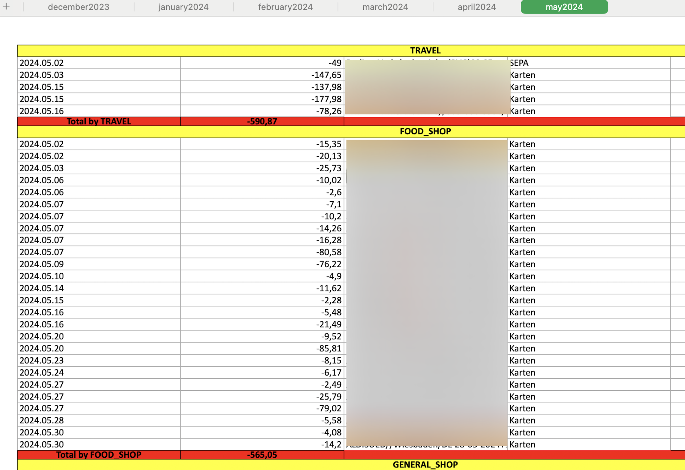

# Expense generator from Deutsche Bank pdf reports

Deutsche Bank's mobile apps don't provide a good way to sort
expenses by category. Yes, there is some basic functionality - but
this functionality doesn't work very well. Perhaps this happens
in my case, but no less.

Fortunately, every month Deutsche Bank sends a **Kontoauszug**
(statement of account) which contains all transactions for
the previous month.

I created a small service that generates the expense report by
categories in excel format based on Kontoauszug PDF files sent
by Deutsche Bank.



## How to use

```pyhton
usage: main.py [-h] [-o OUT] [-i INPUT]

options:
  -h, --help            show this help message and exit
  -o OUT, --out OUT     usage (-o|--out) output file name (default: db_report.xlsx)
  -i INPUT, --input INPUT
                        usage (-i|--input) input folder with pdf reports (default: ./reports)
```

By default, the script expects that PDF report files are in the `reports` folder.

```shell
# ls reports/
may2024.pdf
february2024.pdf
march2024.pdf
april2024.pdf
january2024.pdf
december2023.pdf
```

It is also necessary that the file names be in the format
`text_month_nameYYYY.pdf`, because only this format allows sorting and creating
sheets inside an Excel file to work correctly (**files are parsed from**
**oldest to newest**)

You can also use a `Makefile` to run some commands:

```makefile
make
Usage:
  lint       run lint via pylint
  deps       install dependencies
  help       prints this help message
  generate   generate excel report
  env        create virtual env
  setup      setup virtual env and requirements
```

### Configuration of payment types

You can use the `SHOP_TYPES` map inside the [config.py](./config/config.py) file
to change spending types or add some of your own names of stores or services
inside an existing category.